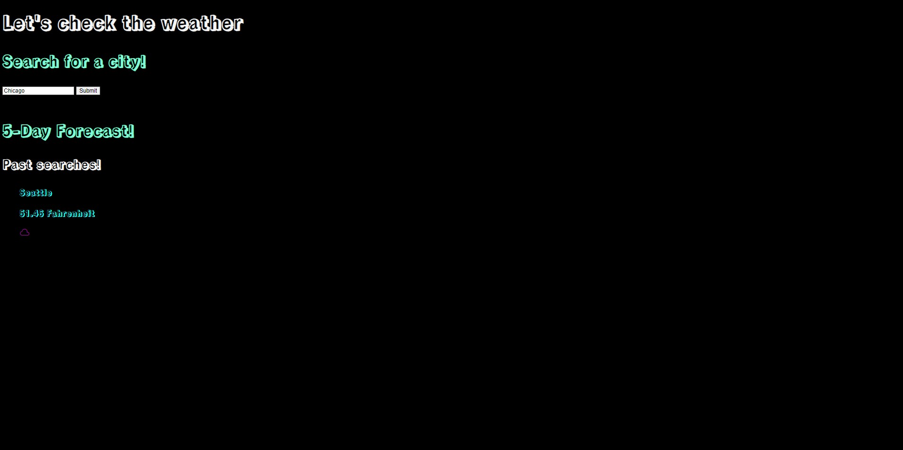
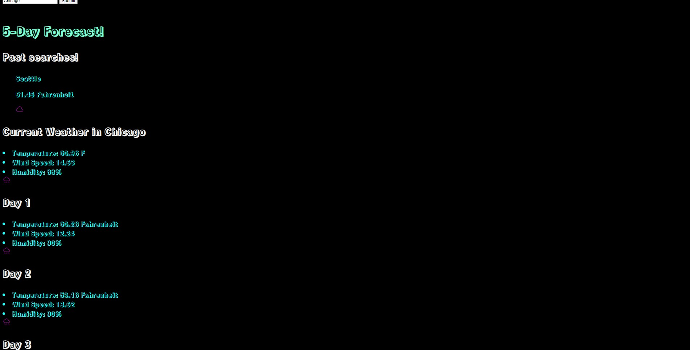

# <Weather Fetcher App>

## Description

Provide a short description explaining the what, why, and how of your project. Use the following questions as a guide:

I created this app to help test and practice my knowledge on the fetch .then pattern. It can show you the weather collected from a weather API. I had refreshers on adding elements to HTML with Javascript. I had some practice with forms, and also navigating json arrays.

## Installation

I am having a problem with the app working in Pages. It is saying that the fetch call is unsecured. However, it works on a live server.

## Usage

Type in a city and you can see the weather for them. Also, you can see some information regarding the last search that you made before refreshing the page.

## Images

