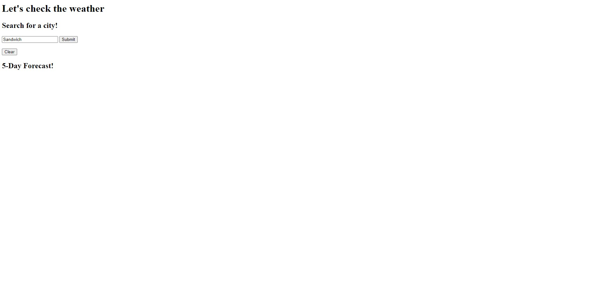
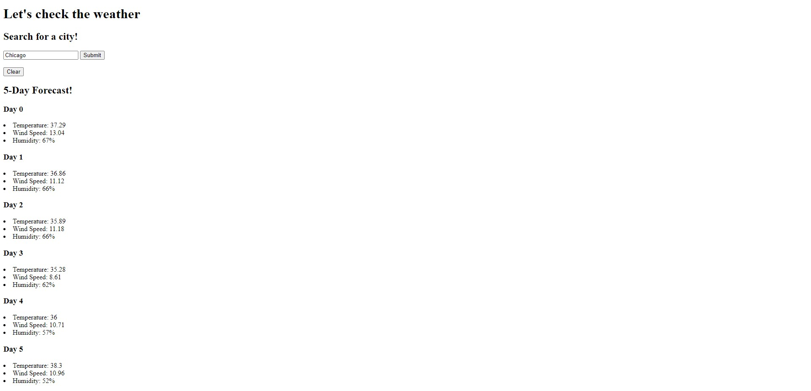

# <Weather Fetcher App>

## Description

Provide a short description explaining the what, why, and how of your project. Use the following questions as a guide:

I created this app to help test and practice my knowledge on the fetch .then pattern. It can show you the weather collected from a weather API. I had refreshers on adding elements to HTML with Javascript. I had some practice with forms, and also navigating json arrays.

## Installation

I am having a problem with the app working in Pages. In Live Server on VS code, the fetch and all associated functions work AFTER the 1st unsuccessful submit. I'm not sure why this is happening, and it was not a problem earlier into the code.

## Usage

Type in a city and you can see the weather for them.

## Images

